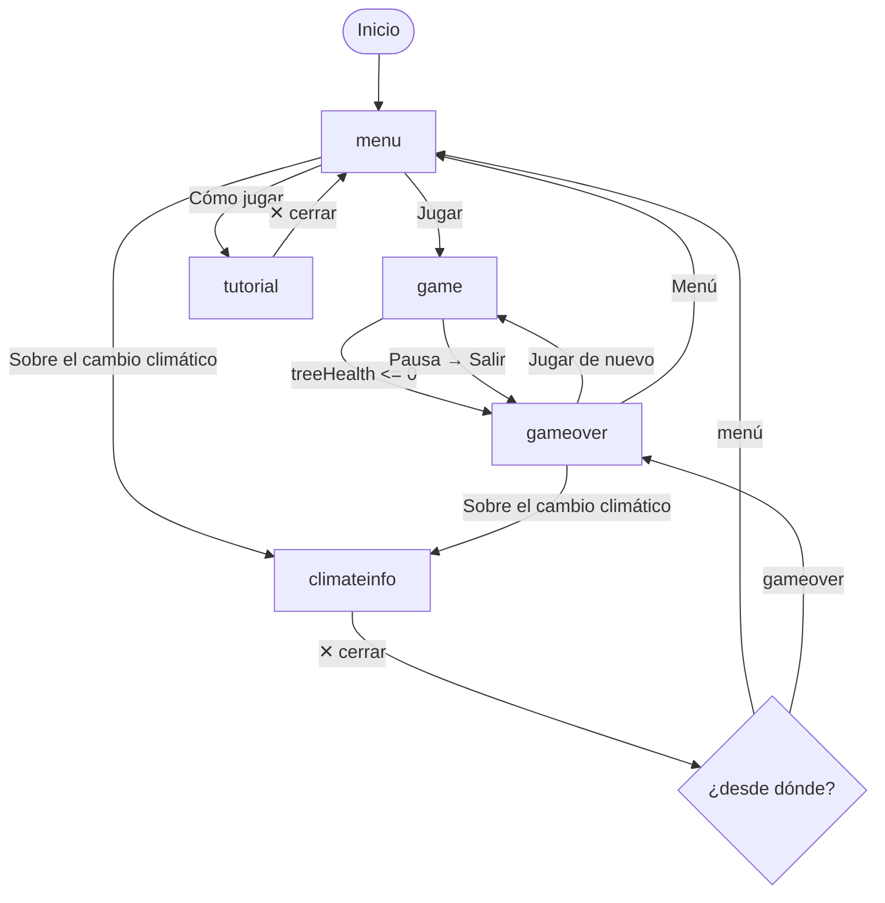

# Documento de Diseño Técnico — Guardabosques

## Visión General

Guardabosques es un juego 2D de defensa tipo slicing construido sobre el motor **Kaplay v3001.0.19** con **Vite** como bundler. El jugador protege un árbol sagrado ubicado en el centro de la pantalla cortando enemigos contaminantes que se aproximan desde los bordes. El proyecto es un fork temático de `mariachi-vs-inflation`, reutilizando su arquitectura de escenas, sistema de slicing, pausa, volumen y dark mode, pero reemplazando la mecánica de caída vertical por movimiento radial hacia el centro.

### Cambio de mecánica central

| Aspecto | mariachi-vs-inflation | guardabosques |
|---|---|---|
| Spawn | y = -60, x aleatorio | Borde aleatorio (top/right/bottom/left) |
| Movimiento | pos.y += speed * dt | Dirección normalizada hacia (240, 427) |
| Condición de miss | y > 920 | Distancia al centro < radio de impacto |
| Estado de vida | hearts [0, 3] | treeHealth [0, 100] |
| Objetivo protegido | Jugador abstracto | Árbol visual en centro |

---

## Arquitectura

### Estructura de archivos

```
guardabosques/
  index.html              # Copia adaptada del base (título, colores)
  package.json            # kaplay + vite, sin dependencias extra
  vite.config.js          # Opcional, solo si se necesita configuración
  src/
    main.js               # Punto de entrada: preload → initGame → createScenes
    i18n.js               # Traducciones ES/EN adaptadas al tema ecológico
  public/
    assets/
      background.png
      background-night.png
      logo.png
      tree.png             # Árbol central
      Enemies/
        humo.png
        talador.png
        barril.png
        fabrica.png
        toxic_blob.png
      PowerUps/
        powerup_slice.png
        powerup_velocidad.png
        powerup_explosion.png
        powerup_regen.png
        powerup_slow.png
```

### Organización interna de main.js

El archivo `main.js` sigue la misma estructura del base, con secciones claramente delimitadas por comentarios:

```
ASSETS_TO_LOAD[]
preloadImages()
initGame(preloadedAssets)
  └─ kaplay({ width:480, height:854, ... })
  └─ loadSprite() × N
  └─ onLoad → createScenes() → k.go('menu')

createScenes(k, preloadedAssets)
  ├─ settings { sfxVolume, nightMode, language }
  ├─ t() helper i18n
  ├─ playSFX()
  ├─ ENEMY_TYPES {}
  ├─ POWERUP_TYPES {}
  ├─ scene('menu')
  ├─ scene('tutorial')
  ├─ scene('climateinfo')
  ├─ scene('game')
  │    ├─ gameState { treeHealth, score, elapsed, paused, ... }
  │    ├─ spawnEnemy(type)
  │    ├─ spawnPowerup(type)
  │    ├─ sliceObject(obj)
  │    ├─ trySliceBetween(a, b)
  │    ├─ distPointToSegment()
  │    ├─ damageTree(amount)
  │    ├─ healTree(amount)
  │    ├─ difficultyMult()
  │    ├─ endGame()
  │    └─ onUpdate loop
  ├─ scene('gameover')
  └─ showToast()
```

---

## Diagrama de flujo de escenas



---

## Componentes e Interfaces

### settings (objeto global dentro de createScenes)

```javascript
const settings = {
  sfxVolume: 0.5,   // [0.0, 1.0]
  nightMode: false,
  language: 'es',   // 'es' | 'en'
};
```

### ENEMY_TYPES

```javascript
const ENEMY_TYPES = {
  humo:       { sprite: 'humo',       speed: [80, 120],  health: 1, damage: 10, points: 10 },
  talador:    { sprite: 'talador',    speed: [140, 180], health: 1, damage: 10, points: 15 },
  barril:     { sprite: 'barril',     speed: [100, 140], health: 2, damage: 10, points: 25 },
  fabrica:    { sprite: 'fabrica',    speed: [80, 110],  health: 1, damage: 20, points: 30, scale: 1.5 },
  toxic_blob: { sprite: 'toxic_blob', speed: [90, 130],  health: 1, damage: 10, points: 20, erratic: true },
};
```

### POWERUP_TYPES

```javascript
const POWERUP_TYPES = {
  slice_grande: { sprite: 'powerup_slice',    effect: 'sliceRadius',  duration: 5  },
  velocidad:    { sprite: 'powerup_velocidad', effect: 'attackSpeed',  duration: 4  },
  explosion:    { sprite: 'powerup_explosion', effect: 'clearAll'                   },
  regeneracion: { sprite: 'powerup_regen',     effect: 'healTree',     amount: 15   },
  slow:         { sprite: 'powerup_slow',      effect: 'slowEnemies',  duration: 4  },
};
```

### gameState (variables locales de scene('game'))

```javascript
let treeHealth = 100;       // entero [0, 100]
let score = 0;              // entero >= 0
let elapsed = 0;            // segundos transcurridos
let paused = false;

// Timers de powerup
let sliceRadiusBonus = 1.0; // 1.0 normal, 1.5 con Slice_Grande
let sliceRadiusTimer = 0;
let attackSpeedBonus = false;
let attackSpeedTimer = 0;
let slowActive = false;
let slowTimer = 0;

// Spawn
let spawnTimer = 0;
let activeEntities = 0;     // contador de enemigos + powerups activos
```

---

## Modelos de Datos

### Entidad Enemigo (componentes Kaplay)

```javascript
k.add([
  k.sprite(type.sprite),
  k.pos(x, y),
  k.anchor('center'),
  k.scale(type.scale ?? 1.0),
  k.area(),
  k.z(10),
  {
    kind: 'enemy',
    enemyType: typeName,       // 'humo' | 'talador' | 'barril' | 'fabrica' | 'toxic_blob'
    health: type.health,       // entero >= 1
    damage: type.damage,       // daño al árbol al llegar al centro
    points: type.points,       // puntos al ser cortado
    speed: randSpeed,          // número en rango [min, max] del tipo
    vx: normalizedDx * speed,  // velocidad X hacia centro
    vy: normalizedDy * speed,  // velocidad Y hacia centro
    sliced: false,             // true = ya fue cortado, no puede cortarse de nuevo
    erratic: type.erratic ?? false,
    erraticTimer: 0,           // timer para variación lateral del toxic_blob
  },
  'enemy',
]);
```

### Entidad Powerup (componentes Kaplay)

```javascript
k.add([
  k.sprite(type.sprite),
  k.pos(x, y),
  k.anchor('center'),
  k.scale(0.9),
  k.area(),
  k.z(10),
  {
    kind: 'powerup',
    powerupType: typeName,
    vx: normalizedDx * speed,
    vy: normalizedDy * speed,
    sliced: false,
  },
  'powerup',
]);
```

### Árbol (entidad estática central)

```javascript
const tree = k.add([
  k.sprite('tree'),
  k.pos(240, 427),
  k.anchor('center'),
  k.z(5),
  'tree',
]);
```

---

## Algoritmos Clave

### 1. Spawn en borde aleatorio

```javascript
function spawnEnemy(typeName) {
  if (activeEntities >= 15) return;

  const type = ENEMY_TYPES[typeName];
  const edge = Math.floor(Math.random() * 4); // 0=top 1=right 2=bottom 3=left
  let x, y;

  if (edge === 0)      { x = k.rand(0, 480); y = -40; }
  else if (edge === 1) { x = 520;            y = k.rand(0, 854); }
  else if (edge === 2) { x = k.rand(0, 480); y = 894; }
  else                 { x = -40;            y = k.rand(0, 854); }

  const CENTER_X = 240, CENTER_Y = 427;
  const dx = CENTER_X - x;
  const dy = CENTER_Y - y;
  const len = Math.sqrt(dx * dx + dy * dy);

  const mult = difficultyMult();
  const baseSpeed = k.rand(type.speed[0], type.speed[1]);
  const speed = baseSpeed * mult;

  const vx = (dx / len) * speed;
  const vy = (dy / len) * speed;

  k.add([ /* componentes con vx, vy */ ]);
  activeEntities++;
}
```

### 2. Movimiento radial en onUpdate

```javascript
k.onUpdate('enemy', (enemy) => {
  if (paused) return;

  const speedMult = slowActive ? 0.5 : 1.0;

  // Movimiento hacia centro
  enemy.pos.x += enemy.vx * speedMult * k.dt();
  enemy.pos.y += enemy.vy * speedMult * k.dt();

  // Movimiento errático del toxic_blob
  if (enemy.erratic) {
    enemy.erraticTimer += k.dt();
    if (enemy.erraticTimer >= 0.5) {
      enemy.erraticTimer = 0;
      const lateral = k.rand(-30, 30);
      // Perpendicular al vector de movimiento
      const perpX = -enemy.vy / Math.sqrt(enemy.vx**2 + enemy.vy**2);
      const perpY =  enemy.vx / Math.sqrt(enemy.vx**2 + enemy.vy**2);
      enemy.vx += perpX * lateral * 0.1;
      enemy.vy += perpY * lateral * 0.1;
      // Re-normalizar para mantener speed
      const currentSpeed = Math.sqrt(enemy.vx**2 + enemy.vy**2);
      const targetSpeed = enemy.speed * speedMult;
      enemy.vx = (enemy.vx / currentSpeed) * targetSpeed;
      enemy.vy = (enemy.vy / currentSpeed) * targetSpeed;
    }
  }

  // Detección de llegada al centro
  const dist = Math.sqrt(
    (enemy.pos.x - 240)**2 + (enemy.pos.y - 427)**2
  );
  if (dist < 40) {
    damageTree(enemy.damage);
    k.destroy(enemy);
    activeEntities--;
  }
});
```

### 3. Sistema de slicing (reutilizado del base)

```javascript
// Reutilizado directamente de mariachi-vs-inflation
function distPointToSegment(px, py, ax, ay, bx, by) {
  const dx = bx - ax, dy = by - ay;
  const lenSq = dx*dx + dy*dy;
  if (lenSq === 0) return Math.sqrt((px-ax)**2 + (py-ay)**2);
  let t = ((px-ax)*dx + (py-ay)*dy) / lenSq;
  t = Math.max(0, Math.min(1, t));
  return Math.sqrt((px - (ax + t*dx))**2 + (py - (ay + t*dy))**2);
}

function trySliceBetween(prevPos, currPos) {
  const sliceRadius = 35 * sliceRadiusBonus; // Slice_Grande: 1.5x

  k.get('enemy').forEach(enemy => {
    if (enemy.sliced) return;
    const d = distPointToSegment(
      enemy.pos.x, enemy.pos.y,
      prevPos.x, prevPos.y,
      currPos.x, currPos.y
    );
    if (d < sliceRadius) {
      sliceObject(enemy);
    }
  });

  k.get('powerup').forEach(powerup => {
    if (powerup.sliced) return;
    const d = distPointToSegment(
      powerup.pos.x, powerup.pos.y,
      prevPos.x, prevPos.y,
      currPos.x, currPos.y
    );
    if (d < sliceRadius) {
      sliceObject(powerup);
    }
  });
}

function sliceObject(obj) {
  obj.sliced = true;

  if (obj.kind === 'enemy') {
    obj.health--;
    if (obj.health > 0) return; // Barril necesita 2 cortes
    score += obj.points;
    scoreText.text = `Score: ${score}`;
    spawnParticles(obj.pos.x, obj.pos.y);
    playSFX('slice');
    k.destroy(obj);
    activeEntities--;
    // Resetear sliced para permitir re-corte en barril (health > 0 ya retornó)
  } else if (obj.kind === 'powerup') {
    applyPowerup(obj.powerupType);
    playSFX('powerup');
    k.destroy(obj);
    activeEntities--;
  }
}
```

**Nota sobre Barril (health=2):** Cuando `health` baja a 1 tras el primer corte, se resetea `sliced = false` para permitir el segundo corte. El score solo se otorga cuando `health` llega a 0.

### 4. Función de dificultad

```javascript
function difficultyMult() {
  return Math.pow(1.1, Math.floor(elapsed / 20));
}

// En onUpdate:
spawnTimer += k.dt();
const spawnInterval = 2.0 / difficultyMult(); // Intervalo base 2s, decrece con tiempo
if (spawnTimer >= spawnInterval) {
  spawnTimer = 0;
  const types = Object.keys(ENEMY_TYPES).filter(t =>
    t !== 'fabrica' || elapsed >= 60
  );
  spawnEnemy(types[Math.floor(Math.random() * types.length)]);
}
```

### 5. damageTree y healTree

```javascript
function damageTree(amount) {
  if (typeof amount !== 'number' || isNaN(amount)) {
    console.error('damageTree: valor inválido', amount);
    return;
  }
  treeHealth = Math.max(0, treeHealth - amount);
  treeHealthText.text = `🌳 ${treeHealth}`;
  // Flash rojo 300ms
  tree.color = k.rgb(255, 80, 80);
  k.wait(0.3, () => { tree.color = k.rgb(255, 255, 255); });
  if (treeHealth <= 0) endGame();
}

function healTree(amount) {
  if (typeof amount !== 'number' || isNaN(amount)) {
    console.error('healTree: valor inválido', amount);
    return;
  }
  treeHealth = Math.min(100, treeHealth + amount);
  treeHealthText.text = `🌳 ${treeHealth}`;
}
```

### 6. Persistencia del high score

```javascript
const HS_KEY = 'guardabosques-high-score';

function loadHighScore() {
  const raw = localStorage.getItem(HS_KEY);
  const parsed = parseInt(raw, 10);
  return isNaN(parsed) ? 0 : parsed;
}

function saveHighScore(newScore) {
  const current = loadHighScore();
  if (newScore > current) {
    localStorage.setItem(HS_KEY, String(newScore));
  }
}

function endGame() {
  saveHighScore(score);
  k.go('gameover', { score, highScore: loadHighScore() });
}
```

---

## Propiedades de Corrección

*Una propiedad es una característica o comportamiento que debe cumplirse en todas las ejecuciones válidas del sistema — esencialmente, una declaración formal sobre lo que el sistema debe hacer. Las propiedades sirven como puente entre las especificaciones legibles por humanos y las garantías de corrección verificables por máquina.*

### Propiedad 1: Invariante de treeHealth

*Para cualquier* secuencia de llamadas a `damageTree(n)` y `healTree(n)` con valores arbitrarios de `n`, el valor de `treeHealth` debe permanecer siempre en el rango entero `[0, 100]`.

**Valida: Requisitos 1.2, 5.5**

### Propiedad 2: Score no negativo

*Para cualquier* secuencia de operaciones de juego (cortes, daños, powerups), el valor de `score` debe ser siempre mayor o igual a 0.

**Valida: Requisito 4.2**

### Propiedad 3: Idempotencia del corte (single-slice)

*Para cualquier* enemigo con `sliced = true`, intentar cortarlo de nuevo no debe modificar `score`, `treeHealth` ni el número de entidades activas.

**Valida: Requisito 2.3**

### Propiedad 4: Trigger de game over

*Para cualquier* valor de `treeHealth` en `(0, 100]` y cualquier daño `d >= treeHealth`, después de llamar `damageTree(d)`, el estado del juego debe ser game over (transición a escena `gameover`).

**Valida: Requisito 1.5**

### Propiedad 5: Movimiento de enemigos hacia el centro

*Para cualquier* enemigo activo en posición `(x, y)` distinta del centro `(240, 427)`, después de un frame de actualización, la distancia del enemigo al centro debe ser estrictamente menor que antes del frame (asumiendo que no hay slow activo que lo detenga completamente).

**Valida: Requisito 3.2, 3.3, 3.4, 3.5, 3.6**

### Propiedad 6: Cap de entidades activas

*Para cualquier* estado del juego, el número de entidades activas (enemigos + powerups) nunca supera 15.

**Valida: Requisito 6.5, 6.6**

### Propiedad 7: Persistencia del high score

*Para cualquier* `score` mayor que el `highScore` almacenado en `localStorage`, después de llamar `endGame()`, el valor en `localStorage['guardabosques-high-score']` debe ser igual a `score`.

**Valida: Requisito 7.1, 7.2**

---

## Manejo de Errores

### Valores inválidos en estado del juego

```javascript
// En damageTree y healTree: validar tipo antes de operar
if (typeof amount !== 'number' || isNaN(amount)) {
  console.error('[guardabosques] valor inválido:', amount);
  return; // mantener estado anterior
}

// Si treeHealth resulta NaN/undefined por bug externo:
k.onUpdate(() => {
  if (typeof treeHealth !== 'number' || isNaN(treeHealth)) {
    console.error('[guardabosques] treeHealth corrupto, activando game over');
    treeHealth = 0;
    endGame();
  }
});
```

### localStorage corrupto

```javascript
function loadHighScore() {
  try {
    const raw = localStorage.getItem(HS_KEY);
    const parsed = parseInt(raw, 10);
    return isNaN(parsed) ? 0 : parsed;
  } catch (e) {
    console.warn('[guardabosques] localStorage no disponible');
    return 0;
  }
}
```

### Assets no encontrados

El sistema de preload de Kaplay maneja errores de carga de sprites. Si un sprite no carga, Kaplay muestra un rectángulo de color como fallback, lo que permite que el juego funcione sin assets finales durante desarrollo.

### Límite de entidades

Si `activeEntities >= 15`, `spawnEnemy()` retorna inmediatamente sin crear la entidad. El contador `activeEntities` se decrementa en `sliceObject()` y en la detección de llegada al centro, garantizando que el límite se respeta.

---

## Estrategia de Testing

### Enfoque dual: tests de ejemplo + tests de propiedad

El proyecto usa **Vitest** como framework de testing y **fast-check** como librería de property-based testing.

```json
// package.json (devDependencies)
"vitest": "^1.x",
"fast-check": "^3.x"
```

### Tests de ejemplo (unit tests)

Cubren comportamientos específicos y casos borde:

- Inicialización: `treeHealth === 100`, `score === 0` al inicio de partida
- Flash rojo: `damageTree()` activa el efecto visual
- SFX: `playSFX('slice')` se llama al cortar un enemigo
- Powerup perdido: `treeHealth` no cambia cuando un powerup sale de pantalla
- localStorage inválido: `loadHighScore()` retorna 0 con datos corruptos
- Pausa: el juego se pausa y reanuda correctamente
- Fábrica bloqueada: no aparece antes de `elapsed >= 60`

### Tests de propiedad (property-based tests)

Cada propiedad del diseño se implementa con un test de fast-check con mínimo 100 iteraciones. Cada test incluye un comentario de trazabilidad:

```javascript
// Feature: guardabosques, Propiedad 1: treeHealth invariante
test('treeHealth siempre en [0, 100]', () => {
  fc.assert(fc.property(
    fc.array(fc.record({
      op: fc.constantFrom('damage', 'heal'),
      amount: fc.integer({ min: 0, max: 50 })
    }), { minLength: 1, maxLength: 50 }),
    (ops) => {
      let health = 100;
      for (const { op, amount } of ops) {
        if (op === 'damage') health = Math.max(0, health - amount);
        else health = Math.min(100, health + amount);
      }
      return health >= 0 && health <= 100;
    }
  ), { numRuns: 100 });
});
```

```javascript
// Feature: guardabosques, Propiedad 2: score no negativo
test('score siempre >= 0', () => {
  fc.assert(fc.property(
    fc.array(fc.constantFrom('humo', 'talador', 'barril', 'fabrica', 'toxic_blob')),
    (enemyTypes) => {
      let s = 0;
      for (const t of enemyTypes) s += ENEMY_TYPES[t].points;
      return s >= 0;
    }
  ), { numRuns: 100 });
});
```

```javascript
// Feature: guardabosques, Propiedad 3: idempotencia del corte
test('cortar enemigo ya cortado no cambia score', () => {
  fc.assert(fc.property(
    fc.constantFrom('humo', 'talador', 'fabrica', 'toxic_blob'),
    fc.integer({ min: 0, max: 1000 }),
    (type, initialScore) => {
      let score = initialScore;
      const enemy = { sliced: false, health: 1, points: ENEMY_TYPES[type].points };
      // Primer corte
      enemy.sliced = true;
      enemy.health--;
      if (enemy.health <= 0) score += enemy.points;
      const scoreAfterFirst = score;
      // Segundo intento (debe ser ignorado)
      if (enemy.sliced) { /* no hacer nada */ }
      return score === scoreAfterFirst;
    }
  ), { numRuns: 100 });
});
```

```javascript
// Feature: guardabosques, Propiedad 4: trigger de game over
test('treeHealth <= 0 activa game over', () => {
  fc.assert(fc.property(
    fc.integer({ min: 1, max: 100 }),
    fc.integer({ min: 0, max: 100 }),
    (health, damage) => {
      const result = Math.max(0, health - damage);
      const shouldBeGameOver = result <= 0;
      return shouldBeGameOver === (health - damage <= 0);
    }
  ), { numRuns: 100 });
});
```

```javascript
// Feature: guardabosques, Propiedad 6: cap de entidades activas
test('activeEntities nunca supera 15', () => {
  fc.assert(fc.property(
    fc.integer({ min: 0, max: 100 }),
    (spawnAttempts) => {
      let active = 0;
      for (let i = 0; i < spawnAttempts; i++) {
        if (active < 15) active++;
      }
      return active <= 15;
    }
  ), { numRuns: 100 });
});
```

```javascript
// Feature: guardabosques, Propiedad 7: persistencia del high score
test('highScore se actualiza cuando score > highScore', () => {
  fc.assert(fc.property(
    fc.integer({ min: 0, max: 10000 }),
    fc.integer({ min: 0, max: 10000 }),
    (currentHigh, newScore) => {
      const stored = newScore > currentHigh ? newScore : currentHigh;
      return stored >= currentHigh && stored >= newScore;
    }
  ), { numRuns: 100 });
});
```

### Reflexión de propiedades (eliminación de redundancia)

Tras revisar las 7 propiedades:

- **P1 y P4** son complementarias, no redundantes: P1 verifica el rango en todo momento, P4 verifica el trigger específico de game over.
- **P2 y P3** son complementarias: P2 verifica que score nunca baja de 0, P3 verifica que cortes duplicados no suman puntos extra.
- **P5 (movimiento hacia centro)** es independiente de las demás.
- **P6 (cap de entidades)** es independiente.
- **P7 (persistencia)** es independiente.

No hay redundancias que eliminar. Las 7 propiedades aportan valor único.

---

## Plan de Reutilización del Código Base

### Reutilización directa (sin modificaciones)

| Componente | Archivo origen | Descripción |
|---|---|---|
| `distPointToSegment()` | main.js | Geometría de detección de corte |
| `trySliceBetween()` | main.js | Lógica de slicing con segmento |
| Trail visual del corte | main.js | Línea de rastro del gesto |
| Sistema de pausa | main.js | Overlay con CONTINUAR/ABANDONAR |
| `playSFX()` con WebAudio | main.js | Síntesis de sonido procedural |
| Dark mode toggle | main.js | Botón y lógica de alternancia |
| Toast system | main.js | Mensajes flotantes temporales |
| Estructura de escenas Kaplay | main.js | `k.scene()`, `k.go()` |
| Loading screen HTML | index.html | Pantalla de carga con timeout |
| Configuración Vite | package.json | Build y dev server |

### Reutilización con adaptaciones

| Componente | Cambio requerido |
|---|---|
| `scene('menu')` | Reemplazar botón "Aprende BTC" por "Sobre el cambio climático"; quitar lógica de save state de partida |
| `scene('tutorial')` | Reemplazar contenido de 6 páginas con mecánicas de guardabosques |
| `scene('learnbtc')` → `scene('climateinfo')` | Renombrar escena; reemplazar contenido BTC por contenido de cambio climático |
| `scene('gameover')` | Quitar leaderboard API, input de nombre y BTC counter; añadir botón "Sobre el cambio climático" |
| `scene('game')` | Reemplazar lógica de caída vertical por movimiento radial; reemplazar hearts por treeHealth; añadir árbol central |
| `i18n.js` | Reemplazar todas las claves BTC/inflación por claves ecológicas |
| `spawnObject()` | Reemplazar por `spawnEnemy()` con lógica de borde aleatorio |
| `handleMiss()` | Reemplazar por detección de llegada al centro (distancia < 40px) |

### Eliminaciones respecto al base

- Leaderboard API (`/api/leaderboard`, `scripts/init-db.js`)
- `@neondatabase/serverless` (dependencia de base de datos)
- Sistema de save state de partida (`mariachi-game-state` en localStorage)
- BTC counter y `scoreToRealBTC()`
- Lógica de HODL y PAPER HANDS
- Mensajes educativos periódicos durante el juego (simplificación)
- Botón de GitHub en menú (opcional, puede mantenerse)
